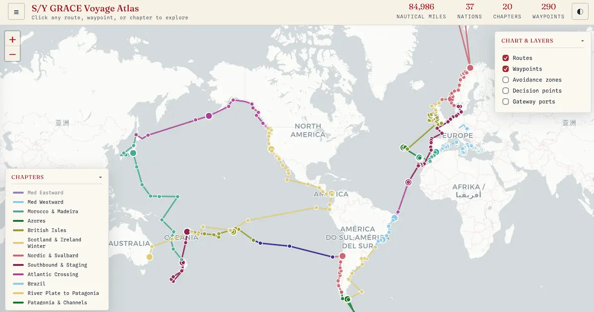

# Voyage Atlas

A pair of self-contained, dependency-light web tools for charting a long voyage as a sequence of **chapters** — strategic groupings of waypoints by region and season. Built for cruisers planning ocean passages and multi-year voyages, but generic enough for any voyage.

In the cruising community, *plan* is a dangerous four-letter word — *"sailors' plans are written in sand and at low tide."* This isn't a planner. An **atlas** is a collection of charts: routes to navigate *by*, not a schedule to be bound *to*.

The project's home page, with the narrative behind the tool, is at [sailingamazinggrace.com/resources/voyage-atlas](https://sailingamazinggrace.com/resources/voyage-atlas).

## What's in the box

1. **Editor** (`voyage-atlas-editor.html`) — builds and maintains an atlas: chapters, waypoints, route geometry, and voyage metadata. Chart-based and table-based editing, geocoding, drag-to-reorder, and JSON / CSV / KML export. Try it live at [sailingamazinggrace.com/resources/voyage-atlas/editor](https://sailingamazinggrace.com/resources/voyage-atlas/editor).
2. **Viewer** (`voyage-atlas.html`) — a read-only interactive chart of a finished atlas. This is what is published or shared. See a full voyage live at [sailingamazinggrace.com/resources/voyage-atlas/viewer](https://sailingamazinggrace.com/resources/voyage-atlas/viewer).

Both are single HTML files. No build step, no framework, no server — open them in any modern browser, host them on any static server, or hand them to someone else, and they behave identically.

The repository also ships a set of optional icon assets (`favicon.svg`, `favicon.ico`, the `favicon-*.png` and `apple-touch-icon.png` images, the `android-chrome-*.png` images) and `site.webmanifest`, which provide the browser-tab favicon and home-screen icons. They are purely cosmetic: a copy hosted without them still runs identically, with the browser falling back to its default tab icon.

## Quick start

1. Download `voyage-atlas-editor.html`, `voyage-atlas.html`, and (optionally) the sample `voyage-data.json` into the same folder. For the favicon and home-screen icons, also include the icon assets and `site.webmanifest` from the repository; they are optional and can be skipped.
2. **To explore the sample:** serve the folder over HTTP (see the note below) and open `voyage-atlas.html`. When `voyage-data.json` sits alongside it, the chart displays automatically; otherwise the viewer opens to a chooser offering the sample (when present) or a file to load.
3. **To build a new atlas:** open `voyage-atlas-editor.html`. It opens to a chooser — pick "Start a new voyage," add a chapter, and start placing waypoints (click the chart, search by name, or type coordinates). Click **Save** to download `voyage-data.json`.
4. **To view a finished atlas:** put the `voyage-data.json` next to `voyage-atlas.html` and open the viewer — or load the file from the viewer's chooser, reachable any time from the header **Load…** button.

The repository ships with a small sample `voyage-data.json` (a short Greek Ionian cruise) so the tools open to a working example. See a full multi-year voyage at the live viewer linked above.

### A note on the data path and `file://`

Each tool resolves its voyage from a `URL_VOYAGE_DATA` constant in the configuration block at the top of its script (`voyage-data.json` by default); a `?data=path` query parameter overrides it per visit. Both accept relative paths only — a remote `http(s)` address is not supported, because a static file cannot guarantee a cross-origin fetch will succeed. Resolving the file requires serving over HTTP — from the published site, a static host, or a one-line local server such as `python3 -m http.server` run in the folder. Opening the HTML files directly from disk (a `file://` URL) cannot fetch a local file: browsers block it as a security measure. In that case the viewer opens to its chooser with a file picker, and the editor opens to its chooser without the sample option.

## Configuration

Both tools keep their self-hosting settings in a labeled configuration block at the top of the script — for the viewer, immediately after the opening `<script>` tag; for the editor, at the top of the `CONSTANTS` section. Editing the values there is all that is needed to point a copy at different data, basemaps, or a different geocoder; the rest of the script is untouched. An unedited copy uses the defaults shown.

| Constant | Tool | Default | Purpose |
|----------|------|---------|---------|
| `URL_VOYAGE_DATA` | both | `voyage-data.json` | The voyage file to load. Relative paths only (a subdirectory or sibling folder is fine); a remote `http(s)` address is not supported. The `?data=path` query parameter overrides it for a single visit. |
| `URL_TILE_LIGHT` | both | CARTO Positron | The day basemap tile layer. |
| `URL_TILE_DARK` | both | CARTO Dark Matter | The night basemap tile layer. |
| `URL_GEOCODE` | editor | `https://nominatim.openstreetmap.org` | The geocoder base URL, used for name-to-coordinate search and reverse country lookup. Point it at a different Nominatim-compatible instance if needed. |

If the tile URLs are changed to another provider, update the attribution string on the tile layers (just below the configuration block) to match that provider's terms. The editor's geocoding requests are paced at one per second to comply with the public Nominatim usage policy; that pacing is fixed in the request queue and is intentionally not a configurable value.

## Features

1. **Chapters** group waypoints by region and season, each with its own color, season window, era (past / current / future), countries, key destinations, notes, and an optional blog link.
2. **Unified waypoint model** — one ordered list per chapter; named rows render as markers, unnamed rows act as shaping vertices that bend the route line without cluttering the chart.
3. **Three independent emphasis flags** per waypoint — Major (M), Gateway (G), Decision (D) — each with distinct chart rendering.
4. **Distance with a pad multiplier** per chapter (accounting for tacking and cruising-ground exploration a straight-line track undercounts), plus an inter-chapter "approach leg" attributed to the destination chapter. All distances can display in nautical miles, kilometers, or miles (stored canonically as nm).
5. **Endpoint sync** — chapters connect end-to-start; a one-click pull keeps shared handoff points aligned, and an indicator shows when a real gap exists.
6. **Geocoding** via OpenStreetMap / Nominatim (rate-limited per their usage policy) — type a name to get coordinates, or fill countries from positions.
7. **Automatic nation / territory classification** against a built-in reference list, with manual overrides.
8. **Exports** — JSON (the master file), CSV (chapters + waypoints, for spreadsheet editing), and KML (for Google Earth).
9. **Self-hosting** — at minimum two HTML files in a directory; the viewer displays its data automatically when served over HTTP, with the source file configurable via a `URL_VOYAGE_DATA` constant or a `?data=` parameter (relative paths only). The optional icon assets and manifest can sit alongside for favicon and home-screen support.
10. **Viewer niceties** — a header **Load…** button and a "Chart your own voyage" link to the editor (both fold into the chapter drawer on small screens); the chooser can be dismissed by its close button, a tap outside it, or Escape when a voyage is already shown; on load the chart frames the whole voyage when it fits, or for a voyage that wraps the globe it opens on the current chapter and the passages ahead; a chapter's info panel links out to its blog post when one is set; and `?import=yes` opens the chooser for loading a different atlas.

## Using the editor

The editor surface has two layers per chapter, opened from the chapter row:

1. **Chapter metadata** — the chapter's name, color, season window, era, countries, key destinations, notes, and blog link. Countries auto-derive from each waypoint's country, with an optional per-chapter override.
2. **Waypoints** — the ordered table of waypoints for the chapter. Each row carries a name, latitude, longitude, the three emphasis flags (M / G / D), a country, and notes. A row with no name is a shaping vertex: it bends the route line but draws no marker.

Additional controls worth knowing:

1. **Emphasis flags** — Major (M) marks a provisioning hub or extended-stay port and draws a larger circle; Gateway (G) marks a customs entry or strategic staging port and draws a star; Decision (D) marks a routing fork or go/no-go point and draws a diamond. Where a waypoint carries more than one flag, the marker shape resolves in priority order M, G, D — the same order the columns are shown in.
2. **Look up countries** — the per-chapter button fills empty country fields for that chapter's waypoints from their coordinates; the global button does the same across every chapter. Both are rate-limited to respect the Nominatim usage policy, so a large lookup runs as a queue rather than all at once.
3. **Expand / collapse all** — toggles every chapter's panels open or closed at once, for surveying the whole voyage or focusing on one chapter.
4. **Rapid click** — when enabled, a single click on the chart drops a new waypoint into the active chapter. Standard chart navigation still works in this mode: drag to pan and scroll to zoom; only the single click is repurposed to place a waypoint.

## Documentation

1. [FAQ & Owner's Manual](docs/voyage-atlas-faq.md) — the full reference for both tools (concepts, editor, viewer, and design principles). **Start here.**
2. [Data schema](docs/voyage-atlas-schema.md) — the JSON / CSV / KML format contract, for hand-editing data or building on the format.
3. [Changelog](CHANGELOG.md) — version history.

## A note on data correctness

The atlas shows exactly what is entered. A charted backtrack, a waypoint on land, or a leg that overshoots a harbor is rendered faithfully and counted honestly — no second-guessing, no silent "corrections." Accuracy of the data is the navigator's responsibility, by design.

## Contributing

Issues and feature suggestions are welcome via the issue tracker. Contributions to the code are best raised in an issue first to discuss the change. The design rationale behind the architecture (why chapters, the predecessor seam, the distance model) is documented for maintainers; non-trivial work is worth a question in an issue before starting.

## License

Copyright (C) 2026 Peter Petrik

This program is free software: you can redistribute it and/or modify it under the terms of the GNU General Public License as published by the Free Software Foundation, either version 3 of the License, or (at your option) any later version.

This program is distributed in the hope that it will be useful, but WITHOUT ANY WARRANTY; without even the implied warranty of MERCHANTABILITY or FITNESS FOR A PARTICULAR PURPOSE. See the GNU General Public License for more details.

You should have received a copy of the GNU General Public License along with this program (see the [`LICENSE`](LICENSE) file). If not, see <https://www.gnu.org/licenses/>.
